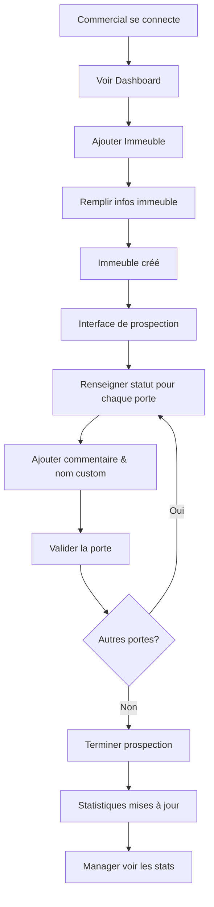

# Documentation - Application de Prospection

## 📋 Vue d'ensemble

**ProspectApp** est une application mobile et web cross-plateforme conçue pour gérer et optimiser les campagnes de prospection commerciale. Chaque commercial dispose d'une tablette pour tracer ses déplacements, ses interactions et ses résultats en temps réel.

---

## 🎯 Objectif Principal

Faciliter le travail de prospection des commerciaux en leur fournissant un outil complet pour :
- Documenter les immeubles et les portes prospectées
- Enregistrer les résultats des interactions (contrats signés, refus, RDV, etc.)
- Consulter des statistiques personnalisées
- Permettre aux managers de superviser leur équipe

---

## 🏗️ Architecture Générale

### Stack Technologique

| Couche | Technologie |
|--------|------------|
| **Backend** | NestJS |
| **Frontend** | Cross-plateforme (Web, iOS, Android) |
| **Base de Données** | (Voir configuration backend) |
| **Authentification** | Gestion des rôles (Admin, Directeur, Manager, Commercial) |

### Hiérarchie des Rôles

```
├─ Admin (Superviseur)
│  └─ Accès complet à tous les immeubles et commerciaux
├─ Directeur (Superviseur)
│  └─ Accès complet à tous les immeubles et commerciaux
├─ Manager
│  └─ Vue sur son équipe de commerciaux
│  └─ Gestion de l'équipe
│  └─ Statistiques de ses commerciaux
└─ Commercial
   └─ Vue personnelle uniquement
   └─ Dashboard avec ses statistiques
```

---

## 📱 Fonctionnalités par Rôle

### 1️⃣ Commercial

#### Dashboard Personnel
Le commercial voit ses statistiques de prospection :

| Métrique | Description |
|----------|------------|
| **Contrats Signés** | Nombre total de contrats signés |
| **Refus** | Nombre de refus catégoriques |
| **Portes Argumentées (Refus)** | Nombre de portes où l'argument a été présenté mais refus final |
| **RDV Pris** | Nombre de rendez-vous planifiés avec date et heure |
| **Absences** | Nombre de portes non ouvertes (1er passage ou 2e passage) |

#### Workflow de Prospection

##### Étape 1 : Ajouter un Immeuble
Avant de commencer la prospection, le commercial doit ajouter l'immeuble :

**Informations Requises :**
- 🏢 Adresse complète
- 🔢 Nombre d'étages
- 🚪 Nombre de portes par étage
- 🛗 Présence d'un ascenseur (Oui/Non)
- 🔐 Code digital (optionnel, peut être saisi si présent)

**Validation :**
- Les données sont envoyées au backend
- L'immeuble est créé et associé au commercial

##### Étape 2 : Interface de Prospection par Immeuble
Une fois l'immeuble ajouté, une interface affiche **toutes les portes** de l'immeuble organisées par étage.

**Pour Chaque Porte, le Commercial Renseigne :**

###### Statut de la Porte
- ✅ **Contrat Signé** → Si oui, préciser le nombre de contrats signés sur cette porte
- ❌ **Refus Catégorique** → Refus net sans argument présenté
- 💬 **Porte Argumentée (Refus)** → Argument présenté mais refus final
- 📅 **RDV Pris** → Date et heure du rendez-vous
- 🚪 **Absent** → Porte fermée (1er ou 2e passage)

###### Informations Additionnelles par Statut

| Statut | Champs Supplémentaires |
|--------|----------------------|
| Contrat Signé | - Nombre de contrats signés<br>- Commentaire optionnel<br>- Nom custom de la porte |
| Refus Catégorique | - Commentaire optionnel<br>- Nom custom de la porte |
| Porte Argumentée (Refus) | - Commentaire optionnel<br>- Nom custom de la porte |
| RDV Pris | - Date et heure<br>- Commentaire optionnel<br>- Nom custom de la porte |
| Absent | - Type d'absence (1er ou 2e passage)<br>- Commentaire optionnel<br>- Nom custom de la porte |

###### Commentaires et Nom Custom
Chaque porte peut avoir :
- 💬 **Commentaire** : Notes personnalisées du commercial
- 🏷️ **Nom Custom** : Renommer la porte pour l'identifier plus facilement (ex: "Famille Martin", "Cabinet Médical", etc.)

#### Historique de Prospection
Le commercial peut consulter l'historique complet de ses prospections :
- Liste de tous les immeubles visités
- Détail des portes et de leurs statuts
- Historique des modifications
- Dates et heures des visites

---

### 2️⃣ Manager

#### Dashboard Manager
Vue globale sur l'équipe :

| Métrique | Description |
|----------|------------|
| **Nombre de Contrats Signés (par commercial)** | Contrats signés par chacun de ses commerciaux |
| **Nombre de Portes Prospectées (par commercial)** | Portes visitées par chacun de ses commerciaux |
| **Nombre de Refus (par commercial)** | Refus catégoriques et argumentés par commercial |
| **RDV Pris** | RDV planifiés par ses commerciaux |
| **Absences** | Portes non ouvertes |

#### Gestion de l'Équipe
Page dédiée à la gestion de l'équipe de commerciaux :
- Vue des commerciaux affectés au manager
- Statistiques détaillées par commercial
- Suivi de la performance
- Possibilité de comparer les résultats

---

### 3️⃣ Admin & Directeur (Superviseurs)

Les administrateurs et directeurs ont :
- ✅ Accès complet à toutes les données
- ✅ Vue sur tous les immeubles
- ✅ Vue sur tous les commerciaux
- ✅ Vue sur tous les managers
- ✅ Possibilité de gérer l'ensemble du système

---

## 🔄 Flux d'Utilisation Complet



---

## 📊 Calcul des Statistiques

### Backend (NestJS)

Toute la logique de calcul des statistiques est gérée par le backend :

- **Contrats Signés** : Somme de tous les contrats par porte
- **Refus** : Somme de tous les refus catégoriques
- **Portes Argumentées (Refus)** : Somme des portes avec argument présenté
- **RDV Pris** : Nombre de portes avec RDV planifié
- **Absences** : Nombre de portes avec absence (1er ou 2e passage)
- **Portes Prospectées** : Nombre total de portes visitées
- **Taux de Conversion** : Nombre de contrats / Nombre de portes

**Localisation du Backend :** `/desktop/rework/backend`

Tous les calculs sont centralisés côté serveur pour garantir la cohérence des données.

---

## 🌍 Cross-Plateforme

L'application est accessible sur :
- 📱 **Tablettes iOS** (iPad)
- 📱 **Tablettes Android** (Samsung Tab, Huawei, etc.)
- 🖥️ **Web** (Accès manager/directeur/admin)
- 💻 **Desktop** (Support optionnel)

### Synchronisation
- Les données sont synchronisées en temps réel avec le backend
- Fonctionnement hors ligne possible (sync ultérieure)
- Responsive design pour tous les appareils

---

## 📐 Structure des Données Clés

### Immeuble
```json
{
  "id": "string",
  "adresse": "string",
  "nbEtages": "number",
  "nbPortesParEtage": "number",
  "ascenseur": "boolean",
  "codeDigital": "string|null",
  "createdAt": "date",
  "commercialId": "string"
}
```

### Porte
```json
{
  "id": "string",
  "immeubleId": "string",
  "etage": "number",
  "numeroPorte": "number",
  "nomCustom": "string|null",
  "statut": "CONTRAT_SIGNE|REFUS|PORTE_ARGUMENTEE|RDV|ABSENT",
  "nombreContrats": "number|null",
  "dateRDV": "date|null",
  "heureRDV": "time|null",
  "typeAbsence": "PREMIER_PASSAGE|DEUXIEME_PASSAGE|null",
  "commentaire": "string|null",
  "createdAt": "date",
  "updatedAt": "date"
}
```

### Commercial
```json
{
  "id": "string",
  "nom": "string",
  "prenom": "string",
  "email": "string",
  "role": "COMMERCIAL",
  "managerId": "string|null",
  "createdAt": "date"
}
```

### Manager
```json
{
  "id": "string",
  "nom": "string",
  "prenom": "string",
  "email": "string",
  "role": "MANAGER",
  "commerciaux": ["string"],
  "createdAt": "date"
}
```

---

## 🔐 Authentification et Autorisation

### Niveaux d'Accès

| Rôle | Lecture | Création | Modification | Suppression | Gestion d'équipe |
|------|---------|----------|--------------|-------------|-----------------|
| **Admin** | ✅ Tous | ✅ Tous | ✅ Tous | ✅ Tous | ✅ Oui |
| **Directeur** | ✅ Tous | ✅ Tous | ✅ Tous | ✅ Tous | ✅ Oui |
| **Manager** | ✅ Équipe | ✅ Non | ✅ Équipe | ❌ Non | ✅ Oui |
| **Commercial** | ✅ Perso | ✅ Perso | ✅ Perso | ❌ Non | ❌ Non |

---

## 📈 Améliorations Futures (Roadmap)

- [ ] Intégration GPS pour tracker les déplacements
- [ ] Notifications en temps réel pour les RDV
- [ ] Export des statistiques en PDF/Excel
- [ ] Graphiques avancés et analytics
- [ ] Intégration CRM
- [ ] Système de bonus/incitations basé sur les stats
- [ ] Chat interne entre manager et commerciaux
- [ ] Planification de tournées optimisées

---

## 🚀 Déploiement

### Prérequis
- Backend NestJS en fonction
- Base de données configurée
- Certificats SSL (production)
- Clés API configurées

### Environnements
- **Développement** : `dev.prospectapp.local`
- **Staging** : `staging.prospectapp.com`
- **Production** : `app.prospectapp.com`

---

## 📞 Support et Documentation

Pour plus de détails sur :
- **Backend** : Voir `/desktop/rework/backend`
- **Configuration** : Voir fichier `.env`
- **API** : Voir documentation Swagger (si disponible)

---

## ✨ Résumé des Fonctionnalités

### Commercial
✅ Dashboard personnalisé avec stats
✅ Ajout d'immeubles
✅ Interface de prospection par porte
✅ Enregistrement des statuts (contrat, refus, RDV, absence)
✅ Commentaires et noms custom par porte
✅ Historique de prospection

### Manager
✅ Dashboard équipe avec stats agrégées
✅ Gestion de l'équipe de commerciaux
✅ Vue détaillée par commercial
✅ Comparaison de performance

### Superviseurs (Admin/Directeur)
✅ Accès complet à toutes les données
✅ Gestion globale du système

---

**Dernière mise à jour :** 25 Décembre 2025
**Version :** 1.0
**Statut :** Documentation complète